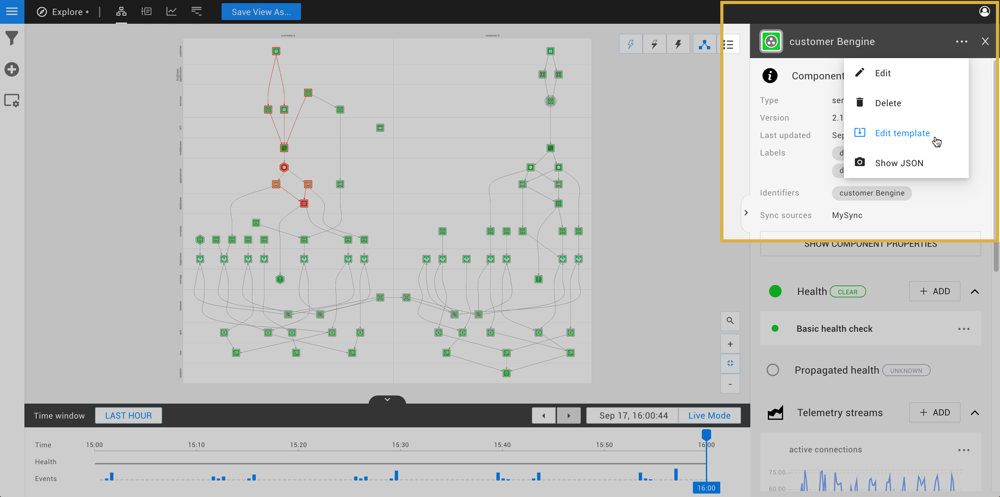

# telemetry\_synchronized\_topology

## Overview

When you have synchronized topology, every component/relation is synchronized via the template it was created with. That means that every time an update is received for a component/relation, that update is executed using the template. The only way to add telemetry or health checks to your synchronized topology is to edit the template with which the component/relation is created. In order to do so, StackState provides a template editor. The following sections will explain how the template editor works.

## Adding Telemetry

In the view, select a component that you'd like to add telemetry to. This opens a component pane on the right side of the screen, where next to the component you'll find a menu with options to edit the component. Click on Edit template.



After selecting the edit template option from the menu, the template editing UI appears


Aside from self-explanatory fields like template, name and description, the template editor is divided into two text editors: The input parameters and the template function. The following sections explain how to add streams and checks to your component using these two editors.

### Input parameters

This section shows the actual data already synchronized to the topology element. All the data shown is accessible to be used while editing the templates. The typical setup is to define a variable `element` which holds the topology element payload and is eventually exposed to the templated interpolation. Here is an example of an AWS lambda function payload:

```text
import com.stackstate.structtype.StructType

def element = StructType.wrapMap([
  "type": [
    "id": 8771488439030,
    "lastUpdateTimestamp": 1549374894208,
    "name": "aws.lambda",
    "model": 158421643423988,
    "_type": "ExtTopoComponentType"
  ],
  "data": [
    "Location": [
      "AwsRegion": "eu-west-1",
      "AwsAccount": "508573134510"
    ],
    "Environment": [
      "Variables": [
        "API_KEY": "API_KEY",
        "STACKSTATE_BASE_URL": "http://9315df6b.ngrok.io"
      ]
    ],
    "Role": "arn:aws:iam::508573134510:role/stackstate-topo-publisher-StackSatePublisherLambda-4J951WJWADBV",
    "Handler": "sts_publisher.lambda_function.lambda_handler",
    "FunctionArn": "arn:aws:lambda:eu-west-1:508573134510:function:StackState-Topo-Publisher",
    "FunctionName": "StackState-Topo-Publisher",
    "Version": "$LATEST",
    "Description": "A Lambda function that publishes topology from a Kinesis stream to StackState",
    "LastModified": "2019-02-05T13:54:23.566+0000",
    "MemorySize": 1024,
    "RevisionId": "7b985ba6-08e6-4f3f-9379-925c4e5f268a",
    "CodeSha256": "jitGoNUCN5USoEjXRd6V9yTeDERgP0Pi7Yc1RpZFebE=",
    "Runtime": "python2.7",
    "Tags": [
      "Aws:cloudformation:stack-id": "arn:aws:cloudformation:eu-west-1:508573134510:stack/stackstate-topo-publisher/78a10570-294d-11e9-8047-062647984902",
      "Origin": "Stackstate",
      "Stackstate-lightweight-agent": "37975427094405",
      "Aws:cloudformation:logical-id": "StackSatePublisherLambda",
      "Aws:cloudformation:stack-name": "stackstate-topo-publisher",
      "Lambda:createdBy": "SAM"
    ],
    "TracingConfig": [
      "Mode": "PassThrough"
    ],
    "CodeSize": 1474331,
    "Timeout": 300
  ],
  "externalId": "arn:aws:lambda:eu-west-1:508573134510:function:StackState-Topo-Publisher",
  "identifiers": [
    "arn:aws:lambda:eu-west-1:508573134510:function:StackState-Topo-Publisher"
  ]
])

def mappingFunction(element) {
  return element;
}

return [
  'element': mappingFunction(element)
]
```

## Template function

This section shows the current template being used to synchronize the topology element. The template function has access to the component payload exposed by the input parameters and relies on using those variables to evaluate the template into a valid json document.

### Streams configuration

The `streams` property is the way to configure telemetry into your topology element, the `streams` is defined as a collection of `DataStreams` which can be either a MetricStream or a EventStream, for example here is the payload for a MetricStream:

```text
{
    ...
    "streams": [
    {
      "_type": "MetricStream",
      "name": "Invocation Duration",
      "query": {
        "conditions": [
            {"key": "Namespace","value": "AWS/Lambda"},
            {"key": "Resource","value": "{{ element.data.FunctionName }}"},
            {"key": "Region","value": "{{ element.data.Location.AwsRegion }}"}
        ],
        "_type": "MetricTelemetryQuery",
        "metricField": "Duration",
        "id": -27,
        "aggregation": "MEAN"
      },
      "dataSource": {{ resolve "DataSource" "CloudWatchSource" }},
      "id": -13,
      "dataType": "METRICS"
    }
    ]
}
```

The template requires the following fields:

* `_type`: The type of Data Stream \[MetricStream\|EventStream\].
* `name`: A name for the Data Stream.
* `query`: Object representing the conditions to filter the stream \[MetricTelemetryQuery,EventTelemetryQuery\].
* `dataSource`: The data source where to connect to fetch the data.
* `dataType`: The kind of data received on the stream \[METRICS\|EVENTS\].

The `query` object is probably the most important atribute of the `stream` object. A `query` object is defined as:

* `_type`: The type of the Query \[MetricTelemetryQuery,EventTelemetryQuery\]
* `conditions`: A collection of Objects with `key` and `value` atributes that represent the predicates that will help filtering the stream. The `key` atributes are defined by the data source that is being used. In the example all `keys` refer to atributes that you can filter on a Cloudwatch query. The `value` accepts String, Numeric or Boolean values.
* `metricField`: The metric that we want to observe in the stream. _Field only available for Metric Streams_.
* `aggregation`: The function to apply in order to aggregate the data. \[MEAN,PERCENTILE\_25,PERCENTILE\_50,PERCENTILE\_75,PERCENTILE\_90,PERCENTILE\_95,PERCENTILE\_98,PERCENTILE\_99,MAX,MIN,SUM,VALUE\_COUNT,EVENT\_COUNT\]. _Field only available for Metric Streams_

## Executing a template

After editing the input parameters and template function, you can preview how the component with the added telemetry would look like by pressing the 'Preview' button below the template function. For example, if we add an extra stream to monitor the `Errors` as:

```text
{
  "_type": "MetricStream",
  "name": "Invocation Error count",
  "query": {
    "conditions": [
      {"key": "Namespace","value": "AWS/Lambda"},
      {"key": "Resource","value": "{{ element.data.FunctionName }}"},
      {"key": "Region","value": "{{ element.data.Location.AwsRegion }}"}
  ],
    "_type": "MetricTelemetryQuery",
    "metricField": "Errors",
    "aggregation": "SUM"
  },
  "dataSource": {{ resolve "DataSource" "CloudWatchSource" }},
  "dataType": "METRICS"
}
```


If any mistakes were made during the editing of the template, the preview function will show you where the errors occurred.


You can also visit the history of previously executed templates. The historic representation will show both the input parameters and template function of a previously executed template, as well as the raw result of that execution. By clicking 'Load this template' you then replace your text editors on the left for the parameters and the function with the one you just loaded from the history.


You can also go to 'Template Examples' and get references on how to build templates. The examples tab also allows you to load an example into the text editors on the left by pressing 'Use this example'.


