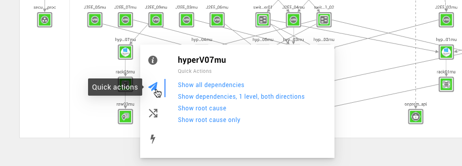

# Browsing topology

The topology is the central part of StackState's 4T data model that makes it possible to reason about how things relate to one another.

By design, there is only one topology per StackState instance to make sure any part of the topology can always be connected to any other part. The topology is, of course, segmented in many different ways depending on your environment. You can narrow down on the part of the topology you are interested in filtering.

## Using basic filtering

The main way of filtering the topology is by using the basic filter pane, accessed using the _filter_ icon.

From here, you can use the basic filter pane to filter the topology on certain properties. If you select a particular property, the topology view will be updated to show only the topology that matches the selected value. Selecting multiple properties narrows down your search \(ie, it combines them using an `AND` operator\). Selecting multiple values for a single property expands your search \(ie, it combines them using an `OR` operator\).

Using the basic filter pane you can select a subset of your topology based on the following properties:

* layers
* domains
* environments
* types
* health state
* tags / labels

Layers, domains, and environments are a way to organize your topology. The health state reflects how the component is functioning. Use labels to make it easy to navigate your topology.

## Filter settings

**Show Components** adds one or more specific components to the topology selection. You can **search** for the component by name.

## Basic filtering example

Here is an example of using the basic filtering capabilities. This example shows how to filter for particular components and customers.

The same topology selection can also be shown in list format:

## Interactive navigation

It is also possible to interactively navigate the topology. Right-click on a component to bring up the component navigation menu:

Selecting an action from the menu allows you to change your view, respective to the selected component.

**Quick Actions** expands the topology selection in one of the following ways:

* Show all dependencies -- shows all dependencies for selected component
* Show dependencies, 1 level, both directions -- limits displayed dependencies to one level from selcted compontent
* Show Root Cause -- if the selected component is in a non-clear state, adds the root cause tree
* Show Root Casue only -- limits displayed components to the root cause elements

**Dependencies** isolates the selected component \(shows only that component\) and expands the topology selection in one of the following ways:

* Direction -- choose between **Both**, **Up**, and **Down**
* Depth -- choose between **All**, **1 level**, and **2 levels**

## Using advanced filtering

If you require more flexibility in selecting topology, check out our [guide to Advanced topology querying with STQL](topology_selection_advanced.md).
