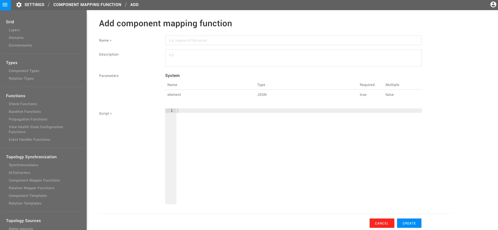

# Mapping functions


This page describes StackState version 4.1.  
Go to the [documentation for the latest StackState release](https://docs.stackstate.com/).


Mapping Function is defined by a groovy script and input parameters that groovy script requires. The goal of Mapping Function is to process topology data of the external system and prepare parameters for the template function.



There are two specific Mapping Function parameters:

* ExtTopoComponent/ExtTopoRelation - these are the required system parameters. Every Mapping Function must define one of these. They are used internally by StackState and cannot be changed using API. They indicate the type of element component or relation the Mapping Function supports.
* TemplateLambda - this is an optional parameter that specifies which template functions must be used with the Mapping Function.

An example of a simple Mapping Function:

```text
def params = [
    'name': element.getExternalId(),
    'description': element.getData().getString("description").get()
];

context.runTemplate(template, params)
```

