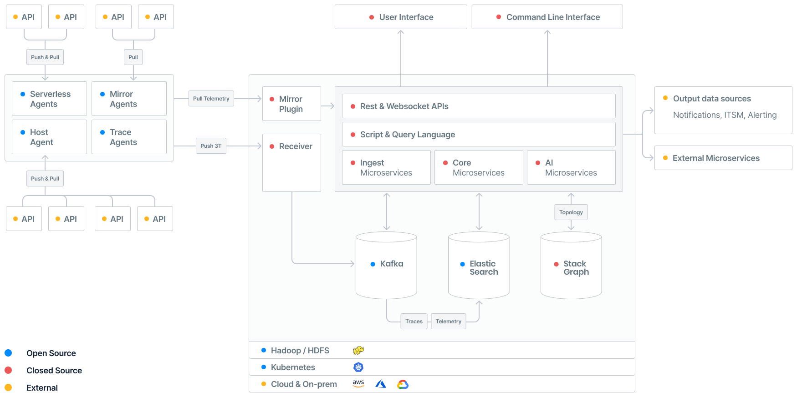

# StackState architecture

## Overview

StackState is built for scale and runs on Kubernetes in your cloud or data center.

In most cases, a single Host Agent is installed on the StackState server to provide Agent-less integration with APIs from multiple sources. Data is gathered and received by one or more Agents and delivered at the Receiver API. From there, all data is put on Kafka. The data is processed by microservices and ends up as Topology in our versioned graph database, called StackGraph. Traces and some of the Telemetry data is temporarily stored in Elastic Search.

A Script and Query Language provides access to all dimensions of the 4T Data Model. They are also used by our own AI Microservices to interface with the 4T Data Model.

REST APIs are available for external services and are also used by our Command Line Interface. Every user interface is kept up to date by Websocket APIs.

Notifications, tickets, webhooks, and API calls are just a few examples of output data sources to let you respond to situations you observe in StackState.

## Data sources

StackState integrates with external systems to retrieve data. Integrations are set up using [StackState Agent](../../stackpacks/integrations/agent.md), [API integration](../../setup/agent/api-integration.md) and/or an associated [integration StackPack](../../stackpacks/integrations/).

## StackGraph

StackState configuration and topology data are stored in the StackGraph database.

## StackState User Interface and CLI

The StackState User Interface visualizes all collected data in [perspectives](perspectives.md). You can also customize your instance of StackState here by adding automization steps, such as event handlers and output to external systems.

You can optionally install the [StackState CLI](../../develop/reference/cli_reference.md) to control your StackState instance directly from the command line.

## Open source

### StackState Agent V2

StackState Agent V2 is open source and available on GitHub:

* Agent - [https://github.com/StackVista/stackstate-agent](https://github.com/StackVista/stackstate-agent)
* Agent integrations - [https://github.com/StackVista/stackstate-agent-integrations](https://github.com/StackVista/stackstate-agent-integrations)

### StackPacks

The StackPacks listed below are open source and available on GitHub:

* Custom Sync StackPack - [https://github.com/StackVista/stackpack-autosync](https://github.com/StackVista/stackpack-autosync)
* SAP StackPack - [https://github.com/StackVista/stackpack-sap](https://github.com/StackVista/stackpack-sap)
* Splunk StackPack - [https://github.com/StackVista/stackpack-splunk](https://github.com/StackVista/stackpack-splunk)

