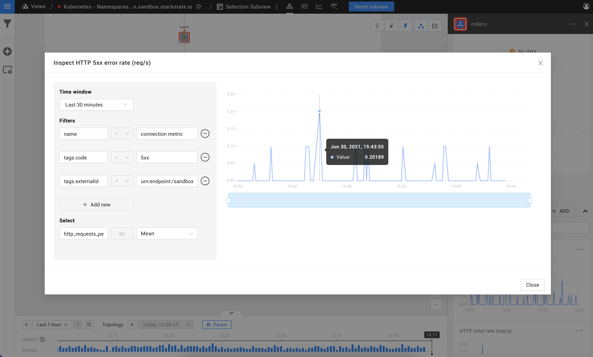
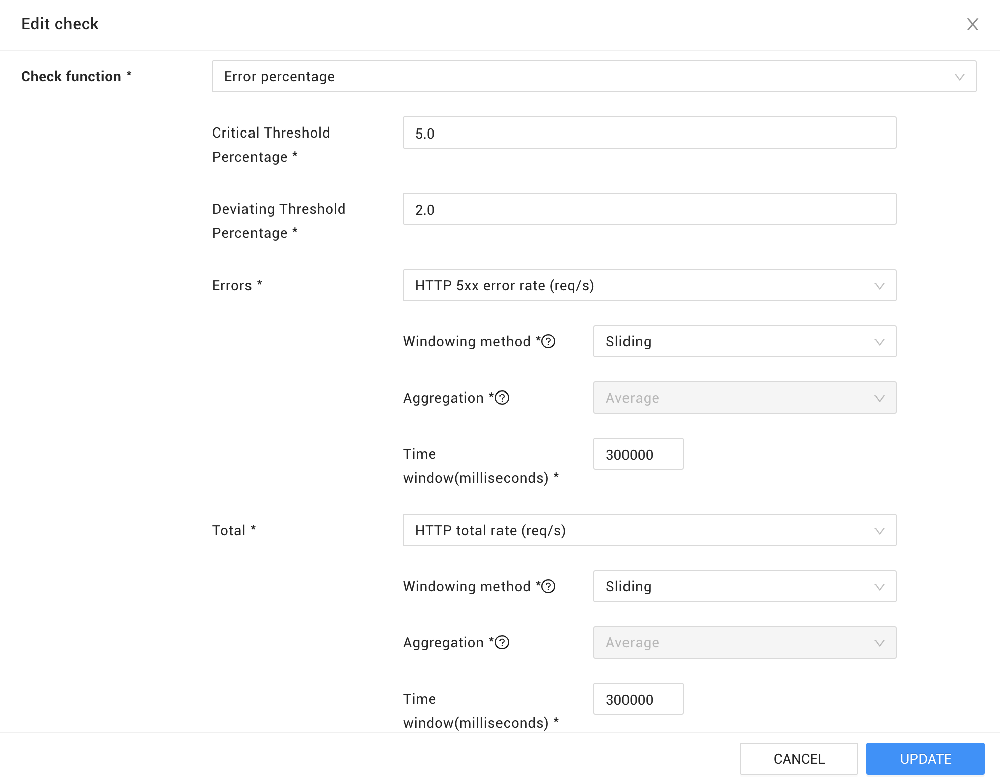

# Golden signals

## Overview

When monitoring distributed systems with a defined SLO (Service Level Objective), StackState can alert you if one of your SLIs (Service Level Indicators) falls bellow a certain threshold. The [four golden signals \(sre.google\)](https://sre.google/sre-book/monitoring-distributed-systems/#xref_monitoring_golden-signals) described on this page can be used to build a check in StackState that responds to fluctuations in service level.

## Four golden signals

### Latency

To monitor the time it takes to service a request, StackState supports metric streams for HTTP response time for processes and services.

To add a latency stream, [add a telemetry stream](../health-state-and-event-notifications/add-telemetry-to-element.md) and select the following metric: `http_response_time_seconds`. You can filter the stream on any HTTP response code or any of the predefined groups:

- any
- success (100-399)
- 1xx
- 2xx
- 3xx
- 4xx
- 5xx

By default, the following response time streams are set for processes and services that serve on HTTP requests:

- HTTP total response time (s) (95th percentile)
- HTTP 5xx error response time (s) (95th percentile)
- HTTP 4xx error response time (s) (95th percentile)
- HTTP Success response time (s) (95th percentile)

### Traffic

Similar to measuring the latency, StackState Agent V2 supports the `http_requests_per_second` telemetry stream. The same response codes and predefined groups are also supported for the traffic stream.

By default, the following request rate streams are set for processes and services that serve on HTTP requests:

- HTTP total rate (req/s)
- HTTP 5xx error rate (req/s)
- HTTP 4xx error rate (req/s)
- HTTP Success rate (req/s)

### Errors

StackState allows you to monitor on any specific HTTP error code or one of the 4xx or 5xx error groups, as explained above. If your SLO specifies a limit for the rate of errors in your system, you can add a check [as explained here](#checks).

### Saturation

There are many ways StackState can help you monitor the saturation of your system, for example:

- HTTP Requests per second.
- CPU usage
- Memory usage

## Checks

To help you meet your SLA (Service Level Agreement) you can create [checks](/use/health-state-and-event-notifications/health-state-in-stackstate.md#health-checks) in StackState. Examples of using a check function to monitor error percentage and response time are given below.

When selecting a metric stream for a health check, you will have some options to configure its behavior:

- Windowing method: [more details in this page](../health-state-and-event-notifications/add-a-health-check.md#windowing-method).
- Aggregation: [see here a list of all possible aggregation methods](../../develop/reference/scripting/script-apis/telemetry.md#aggregation-methods).
- Time window (or window size): By default the time window is 300000 milliseconds (or 5 minutes). The greater the time window is, less frequent your health state will be updated. Though if you configure it too small, you might have too many state changes for the component.

### Check function: Error percentage 

The `Error percentage` check function monitors two streams - one reporting errors and one reporting a total. A DEVIATING health state is returned when the percentage of errors/total crosses the specified `DeviatingThresholdPercentage` and a CRITICAL health state is returned when the error percentage crosses the specified `CriticalThresholdPercentage`.

If your SLO defines that a service can have a maximum of 5% of requests failing, you can create a check using the `Error percentage` function and set the `Critical Threshold Percentage` to `5.0`:

### Check function: Total response time check

To help you meet your SLA, you can also create a check to make sure your maximum response is below a certain threshold:

## Limitations

Currently, StackState Agent V2 can only report on rate and response time of HTTP/1. HTTP/2, HTTP/3 and HTTPS are not supported.