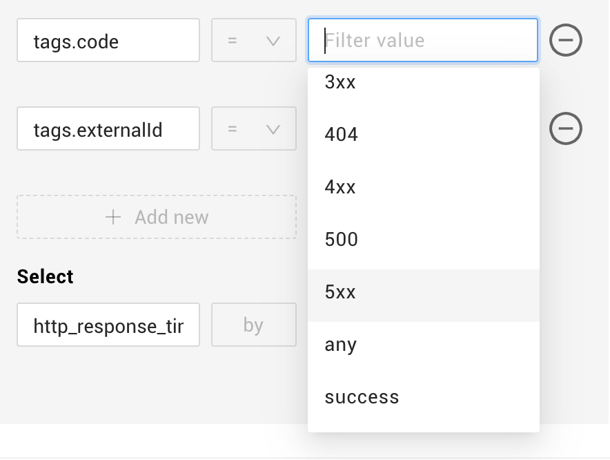
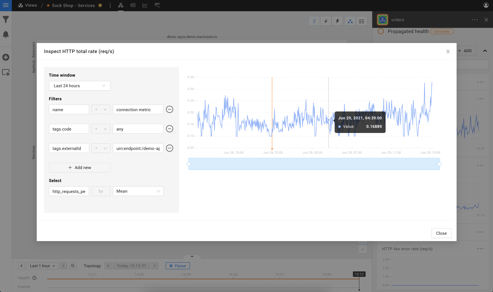

# Golden signals

## Overview

When monitoring distributed systems with a defined SLO (Service Level Objective), StackState can alert you if one of your SLIs (Service Level Indicators) falls below a certain threshold. The [four golden signals \(sre.google\)](https://sre.google/sre-book/monitoring-distributed-systems/#xref_monitoring_golden-signals) described on this page can be used to build a check in StackState that responds to fluctuations in service level.

The checks described in this page do not ensure you are meeting your SLO directly, but they can help you prevent an SLO violation by catching (and alerting on) changes in your SLIs as soon as possible.

## Four golden signals

### Latency

To monitor the time it takes to service a request, StackState supports metric streams for HTTP response time for processes and services.

To add a latency stream, [add a telemetry stream](../health-state-and-event-notifications/add-telemetry-to-element.md) and select the following metric: `http_response_time_seconds`. You can filter the stream on any HTTP response code or any of the predefined groups:

- any
- success (100-399)
- 1xx
- 2xx
- 3xx
- 4xx
- 5xx

By default, the following response time streams are set for processes and services that serve on HTTP requests:

- HTTP total response time (s) (95th percentile)
- HTTP 5xx error response time (s) (95th percentile)
- HTTP 4xx error response time (s) (95th percentile)
- HTTP Success response time (s) (95th percentile)

### Traffic

Similar to measuring the latency, StackState Agent V2 supports the `http_requests_per_second` telemetry stream. The same response codes and predefined groups are also supported for the traffic stream.

By default, the following request rate streams are set for processes and services that serve on HTTP requests:

- HTTP total rate (req/s)
- HTTP 5xx error rate (req/s)
- HTTP 4xx error rate (req/s)
- HTTP Success rate (req/s)

### Errors

StackState allows you to monitor on any specific HTTP error code or one of the 4xx or 5xx error groups, as explained above. If your SLO specifies a limit for the rate of errors in your system, you can [add a check](#checks).

### Saturation

There are many ways StackState can help monitor the saturation of a system, for example:

- HTTP Requests per second
- CPU usage
- Memory usage

## Checks

To help you meet your SLA (Service Level Agreement) you can [create checks](/use/health-state-and-event-notifications/health-state-in-stackstate.md#health-checks) in StackState. Examples of using a check function to monitor error percentage and response time are given below.

When selecting a metric stream for a health check, you will have some options to configure its behavior:

- **Windowing method** - [More details in this page](../health-state-and-event-notifications/add-a-health-check.md#windowing-method).
- **Aggregation** - [List of all available aggregation methods](../../develop/reference/scripting/script-apis/telemetry.md#aggregation-methods).
- **Time window (or window size)** - By default the time window is 300000 milliseconds (or 5 minutes). The time window will directly influence the number of positive or false negative alerts. The longer you configure the time window, the less sensitive it will be. However, if it is too short this may lead to a sudden spike in unwanted alerts, which might not help you meet your SLO. You should balance the time window based on the metric and how early you want to be alerted on spikes.

### Example: Error percentage

The `Error percentage` check function can be used to monitor two streams - one reporting errors and one reporting a total. A DEVIATING or CRITICAL health state will be returned if the percentage of errors/total crosses the specified `DeviatingThresholdPercentage` or `CriticalThresholdPercentage`.

If your SLO defines that a service can have a maximum of 5% of requests failing, you can create a check using the `Error percentage` function and set the `CriticalThresholdPercentage` to `5.0`:

### Example: Response time

The `Greater than or equal` check function can alert you when one of your telemetry streams is above a certain threshold. A DEVIATING or CRITICAL health state will be returned if the specified `DeviatingThreshold` or `CriticalThreshold` is crossed.

Use this function to make sure you meet your SLO for maximum response time, for example:

## Configuration and limitations

The metrics described in this page are gathered by the StackState Agent and can be disabled. Refer to the [StackState Agent documentation](/setup/agent/about-stackstate-agent.md) for more information. Currently, the StackState Agent can only report on request rate and response time of HTTP/1 protocol. HTTP/2, HTTP/3 and HTTPS protocols are not yet supported.
