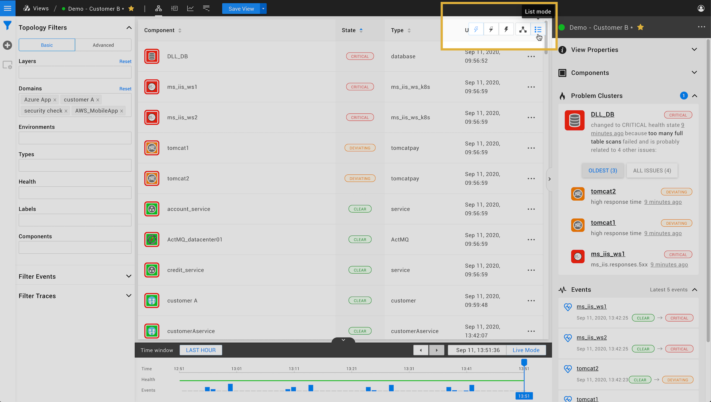

# Filtering

The View Filters pane on the left side of the StackState UI in any View allows you to apply Filters to the components and other information displayed in perspectives.

###Topology Filters

Topology Filters can be used to select a sub-set of topology components to be shown in any one of the available perspectives. You can browse your topology using basic filters or build use the StackState in-built query language (STQL) to build an advanced topology filter that zooms in on a specific area of your topology. Read more about:

* [Basic topology filters](#basic-topology-filters)
* [Advanced topology filters with STQL](../../configure/topology_selection_advanced.md)
* [Topology filtering limits](#topology-filtering-limits)

### Basic topology filters

The main way of filtering the topology is by using the basic filter panel, accessed using the _filter_ icon.

From here, you can use the basic filter panel to filter the topology on certain properties. If you select a particular property, the topology view will be updated to show only the topology that matches the selected value. Selecting multiple properties narrows down your search \(ie, it combines them using an `AND` operator\). Selecting multiple values for a single property expands your search \(ie, it combines them using an `OR` operator\).

You can use the basic filter panel to select a subset of your topology based on the following properties:

* Layers
* Domains
* Environments
* Types
* Health - reflects how the component is functioning
* Labels - make it easy to navigate your topology
* Components

### Filter settings

**Show Components** adds one or more specific components to the topology selection. You can **search** for the component by name.

### Basic filtering example

Here is an example of using the basic filtering capabilities. This example shows how to filter for particular components and customers.


The same topology selection can also be shown in list format:



### Advanced topology filters

You can use the StackState in-built query language (STQL) to build an advanced topology filter that zooms in on a specific area of your topology. Read more about [Advanced topology filters with STQL](../../configure/topology_selection_advanced.md).

### Topology filtering limits

To optimize performance, a configurable limit is placed on the amount of elements that can be loaded to produce a topology visualization. The filtering limit has a default value of 10000 elements, this can be manually configured in `etc/application_stackstate.conf` using the parameter `stackstate.topologyQueryService.maxStackElementsPerQuery`.

If a [basic filter](#basic-topology-filters) or [advanced filter query](/configure/topology_selection_advanced.md) exceeds the configured filtering limit, you will be presented with an error on screen and no topology visualization will be displayed.

Note that the filtering limit is applied to the total amount of elements that need to be loaded and not the amount of elements that will be displayed.

In the example below, we first LOAD all neighbors of every component in our topology and then SHOW only the ones that belong to the `applications` layer. This would likely fail with a filtering limit error, as it requires all components to be loaded.
```text
withNeighborsOf(direction = "both", components = (name = "*"), levels = "15")
   AND layer = "applications"
```

To successfully produce this topology visualization, we would need to either re-write the query to keep the number of components loaded below the configured filtering limit, or increase the filtering limit.

## Filter Events

You can use the View Filters pane to filter the type of events shown in the [Events Perspective](event-perspective.md).

## Filter Traces

The traces shown in the [Traces Perspective](trace-perspective.md) can be filtered by **Tags** or **Span Types**. Read more about [FIlter Traces](trace-perspective.md#trace-filters)
