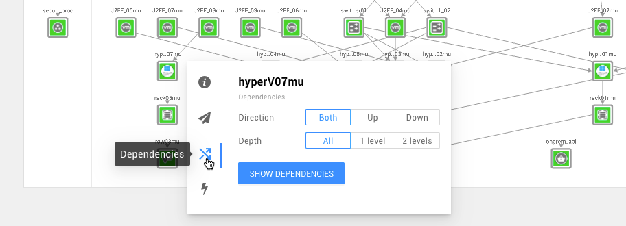
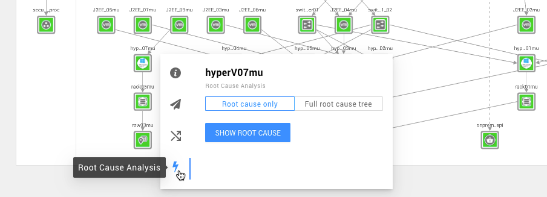

# Topology Perspective

The Topology Perspective displays the components in your IT landscape and their relationships.

## Components and relations

The Topology Perspective shows components and relations in the selected [view](../views.md). Components that have one or more [checks](../../configure/checks_and_streams.md#checks) configured will have a calculated [health state](../../configure/propagation.md).

## Component details

When a component is selected by clicking on it, the Component Details panel is shown on the right hand side. This panel displays detailed information of the component:

* metadata such as the component's name, type and labels
* [health checks](../../configure/checks_and_streams.md#checks)
* [telemetry streams](../../configure/checks_and_streams.md#data-streams)

## Filtering

The View Filters panel on the left side of the screen in any View allows you to filter the topology components displayed. Read more about [Topology Filters](filters.md#topology-filters)

## Interactive navigation

The topology can also be navigated interactively. Hover over any component to bring up the component navigation menu. The available options allow tyou to change your view respective to the selected component.

### Quick actions

Quick actions expand the topology selection in one of the following ways:

* Show all dependencies -- shows all dependencies for selected component
* Show dependencies, 1 level, both directions -- limits displayed dependencies to one level from selected component
* Show Root Cause -- if the selected component is in a non-clear state, adds the root cause tree
* Show Root Cause only -- limits displayed components to the root cause elements

You can extend this list with [component actions](../../configure/component_actions.md) that are pre-defined in a StackPack or configure your own actions.

### Dependencies

Isolate the selected component \(show only that component\) and expand the topology selection in one of the following ways:

* Direction -- choose between **Both**, **Up**, and **Down**
* Depth -- choose between **All**, **1 level**, and **2 levels**

If you require more flexibility in selecting topology, check out our [guide to Advanced topology querying with STQL](../../configure/topology_selection_advanced.md).

### Root Cause Analysis

Isolate the selected deviating component \(show only that component\) and expand the topology selection in one of the following ways:

* **Root cause only** -- only show the root cause component
* **Full root cause tree** -- the entire root cause tree

You can also [show root cause outside the current view](#root-cause-outside-current-view)

## Component finder

Locate a specific component in the view by typing the first few letters of it's name in the Topology Perspective. Alternatively, you can select the **Component finder** icon magnifying glass in the bottom right corner of the topology visualizer.

## Zoom in, zoom out and Fit to Screen

There are zoom buttons located in the bottom right corner of the topology visualizer. The **plus** button zooms in on the topology, the **minus** button zooms out. In between both buttons is the **fit to screen** button which zooms out so the complete topology becomes visible.

## Problem clusters

If one or more components have a critical state, StackState will show the related components and their states as a Problem Cluster in the [View Overview pane](../views.md#view-overview).

## Root cause outside current view

If there are components with [telemetry streams](../../configure/checks_and_streams.md#data-streams) and [health checks](../../configure/checks_and_streams.md#checks) in your view, the Topology Perspective will calculate a health state and [propagate](../../configure/propagation.md) this state throughout the graph. This means your view can contain components that have a deviating health state caused by a component that is outside your view.

The Topology Perspective allows you to configure whether to show a root cause _that is outside of the currently displayed view_:

* **Don't show root cause** -- do not show the root cause
* **Show root cause only** -- only show the root cause component
* **Show full root cause tree** -- show the entire root cause tree

## List mode

The components in the topology visualization can also be shown in a list instead of a graph:

