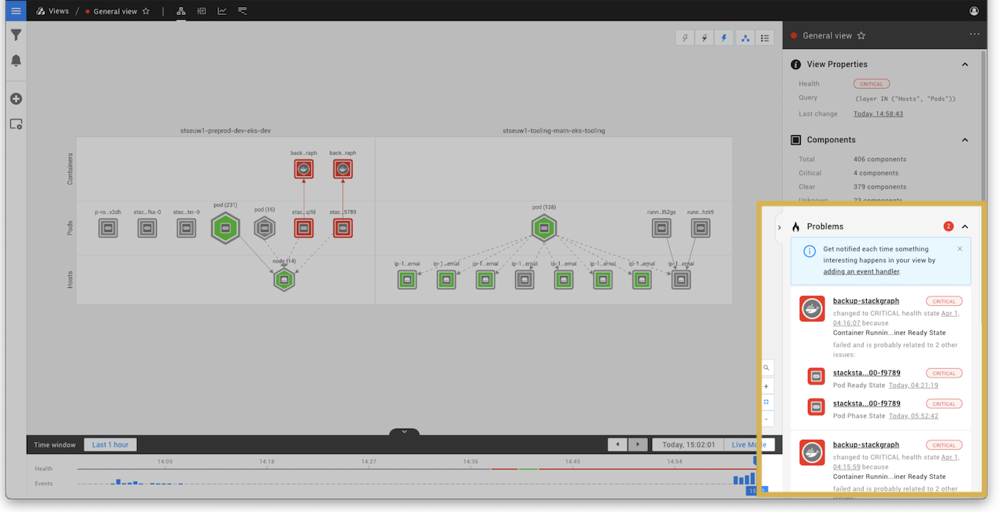

# What is a problem?

## Overview

When a component or relation reports a DEVIATING \(orange\) or CRITICAL \(red\) state, StackState will identify this as a problem in your IT environment. As StackState is aware of the connections and dependencies between components in the topology, related unhealthy state changes can be grouped together into a single problem with a single root cause. This is helpful because it will:

* **Speed up problem investigation** - all unhealthy elements affected by a single root cause can be found in a dedicated sub-view.
* **Reduce noise** - the evolution of the problem can be be tracked as a single entity, rather than a collection of individual, unhealthy elements.

## What is a StackState problem?

A problem in StackState is the collection of unhealthy components that can be attributed to a single root cause. A problem contains the following components:

* A single root cause - this is the unhealthy component at the bottom of the dependency chain.
* Any number of contributing causes - these are all the unhealthy components that depend on the root cause.


It is possible for a single unhealthy component to be a contributing cause in two separate problems. If there are two potential root cause components for a component's unhealthy state, StackState will see this as two separate problems.


## Lifecycle of a problem

### Problem created

When a component in a view changes its health state to DEVIATING or CRITICAL, it will become part of a problem. Each problem in StackState has a single root cause component. If a problem does not already exist with the same root cause as the component that changed its health state to unhealthy, a new problem will be created.

The following event will be generated:

* `ProblemCreated` event for the new problems.

New problems can also be created in response to a change in root cause of an existing problem. If the root cause component of an existing problem switches its state to healthy, the next unhealthy component at the bottom of the dependency chain will become the new root cause of the problem. As each StackState problem can only have one root cause, if there are now two or more potential root causes StackState will split the problem. A new problem will be created for each potential root cause.

The following events will be generated:

* One `ProblemUpdated` event for the problem whose new root cause has the oldest health state change timestamp of all new potential root causes. 
* `ProblemCreated` events for all other new problems.

### Problem updated

Whenever new information is available for an existing problem, the problem will be updated. For example, a new root cause or contributing cause being added to the problem, or an update to a check on an existing unhealthy component.

The following events will be generated:

* `ProblemUpdated` event for the existing problem

`ProblemUpdated` events are also generated when a change in root cause results in a problem being [subsumed](#problem-subsumed) or [split](#problem-created).  

### Problem subsumed

If a component switches its state to unhealthy and in doing so becomes the new root cause for more than one existing problem, StackState will combine all of these problems into one problem. The original problems will all be incorporated \(subsumed\) into the oldest problem with the same root cause. The oldest problem, into which all other problems have been subsumed, will have its root cause updated to be the new root cause component. This would happen, for example, if an upstream dependency of two root cause components switched to an unhealthy state.

The following events will be generated:

* One `ProblemUpdated` event for the oldest problem.
* `ProblemSubsumed` events will be generated for all other problems.

### Problem resolved

When the root cause and all contributing cause components have changed to a CLEAR \(green\) health state, the problem is considered as resolved and will no longer be visible in the StackState UI. A `Problem resolved` event will be generated.

The following event will be generated:

* `ProblemResolved` event for the resolved problem.

If the components change back to an unhealthy state in the future, this will be reported in StackState as a new problem.

## See also

* [How to navigate through a problem in the StackState UI](problem_investigation.md)
* [Anomaly detection](../introduction-to-stackstate/anomaly-detection.md)
* [Problem notifications](problem_notifications.md)

